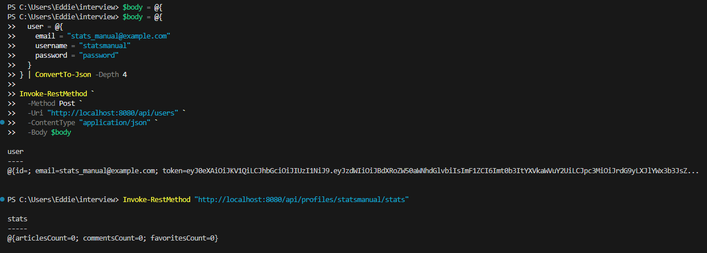

# Testing and Submission Steps

This file documents how I tested the project locally and how I prepared the GitHub/Copilot workflow for submission.

## 1. Run the Automated Tests

From the repository root:

```powershell
cd C:\Users\Eddie\interview\kotlin-ktor-realworld-example-app
.\gradlew.bat test
```

Expected result:

```text
BUILD SUCCESSFUL
```

## 2. Run the Full Build

```powershell
.\gradlew.bat build
```

Expected result:

```text
BUILD SUCCESSFUL
```

## 3. Start the API Locally

In one PowerShell window:

```powershell
cd C:\Users\Eddie\interview\kotlin-ktor-realworld-example-app
.\gradlew.bat run
```

The API runs on:

```text
http://localhost:8080
```

## 4. Manually Register a User

In a second PowerShell window:

```powershell
$body = @{
  user = @{
    email = "stats_manual@example.com"
    username = "statsmanual"
    password = "password"
  }
} | ConvertTo-Json -Depth 4

Invoke-RestMethod `
  -Method Post `
  -Uri "http://localhost:8080/api/users" `
  -ContentType "application/json" `
  -Body $body
```

Expected result:

```text
The API returns the created user with an email, username, and token.
```

## 5. Manually Test the New Stats Endpoint

```powershell
Invoke-RestMethod "http://localhost:8080/api/profiles/statsmanual/stats"
```

Expected result for a newly created user:

```text
articlesCount=0
commentsCount=0
favoritesCount=0
```

## 6. Manual Test Screenshot

The screenshot below shows the manual test where I registered a user and called the new stats endpoint.



## 7. GitHub CLI Setup

GitHub CLI was installed locally at:

```text
C:\Users\Eddie\tools\bin\gh.exe
```

If `gh` is not found in a new terminal, either reopen PowerShell or run:

```powershell
$env:Path = "$env:Path;C:\Users\Eddie\tools\bin"
```

Then verify:

```powershell
gh --version
```

## 8. Authenticate GitHub CLI

```powershell
gh auth login
```

Recommended choices:

- GitHub.com
- SSH
- Login with browser

## 9. Create the Copilot Issue

The Copilot prompt is saved in:

```text
.github/copilot-user-stats-issue.md
```

After logging in with `gh auth login`, create the issue:

```powershell
gh issue create `
  --repo eharryops/kotlin-ktor-realworld-example-app `
  --title "Copilot: add tests for user activity stats endpoint" `
  --body-file .github/copilot-user-stats-issue.md
```

If GitHub shows an option to assign or delegate the issue to Copilot, use that option.

## 10. Push the Branch and Open the Pull Request

```powershell
git status
git add .
git commit -m "Add user activity stats endpoint with tests and CI"
git push -u origin feature/user-activity-stats
```

Then open a pull request from:

```text
feature/user-activity-stats
```

into:

```text
main or master
```

The repository includes a pull request template with the project summary, testing notes, Copilot notes, and tradeoffs.
